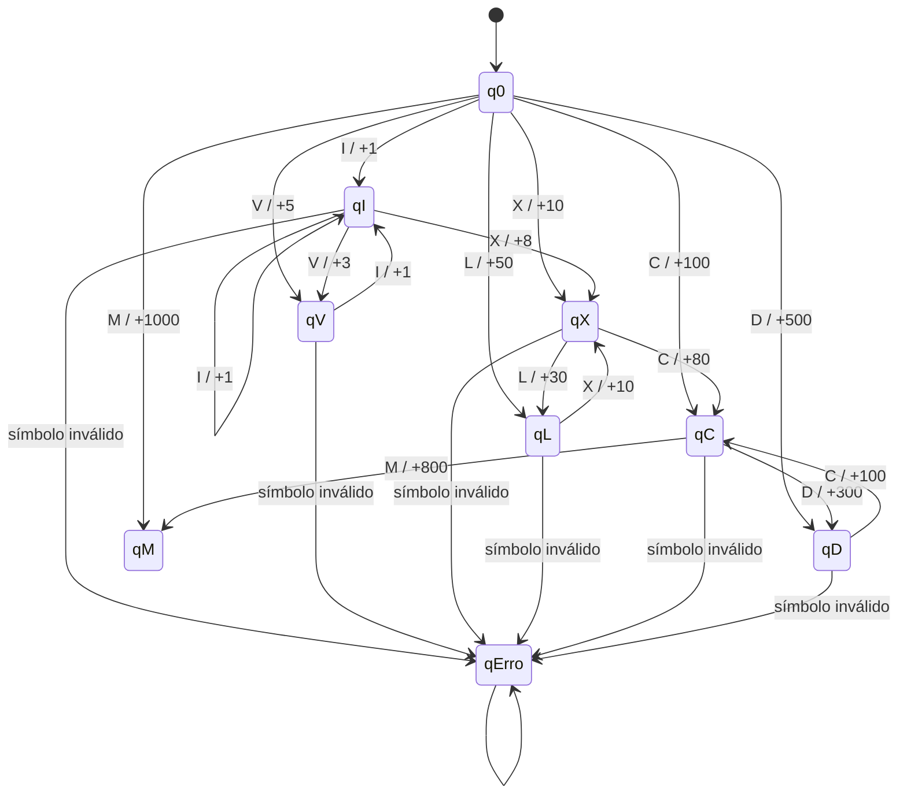
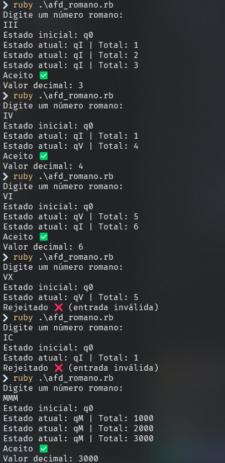

# Modelo Formal — Transdutor Finito Determinístico

Queremos um Autômato Finito Determinístico:

- Reconhece números romanos válidos (≤ 3999)

- Converte para decimal

- Rejeita entradas inválidas
  

## 📔 Tipo de Transdutor: Mealy

### 👉 Usei Transdutor de Mealy, porque:

- A saída depende da transição (estado + símbolo lido)
- Precisamos somar/subtrair durante a leitura
- Moore exigiria estados demais (armazenando valores parciais)

### 💡 Exemplo:

Ler I → pode somar +1

Se depois vier V → corrigir para −1 e somar +5, retornando **IV = 4**

A emissão acontece durante a transição, não ao entrar no estado.

## Definição Formal

### Um transdutor Mealy é:

                                    𝑇 = (𝑄,Σ,Γ,𝛿,𝜆,𝑞0,𝐹) 

### 🔤 Alfabeto de Entrada
                                    Σ = {𝐼,𝑉,𝑋,𝐿,𝐶,𝐷,𝑀}

### 🔤 Alfabeto de Saída

Como estamos acumulando um valor inteiro:

                                            Γ = 𝑍

(saídas são incrementos ou decrementos)

## Conjunto de Estados

Usaremos estados que representam:

último símbolo lido (para decidir soma/subtração)

### estados inválidos
                            𝑄 = {𝑞0, 𝑞𝐼, 𝑞𝑉, 𝑞𝑋, 𝑞𝐿, 𝑞𝐶, 𝑞𝐷, 𝑞𝑀, 𝑞𝑒𝑟𝑟𝑜}

| Estado | Significado                   |
| ------ | ----------------------------- |
| q0     | início (nenhum símbolo ainda) |
| qI     | último símbolo foi I          |
| qV     | último símbolo foi V          |
| qX     | último símbolo foi X          |
| qL     | último símbolo foi L          |
| qC     | último símbolo foi C          |
| qD     | último símbolo foi D          |
| qM     | último símbolo foi M          |
| qErro  | estado de rejeição            |

​
### Estado Inicial
                                              𝑞0	​

### Estados de Aceitação

Todos exceto o erro:

                                        𝐹 = 𝑄 − {𝑞𝑒𝑟𝑟𝑜}

## Mermaid 

[Diagrama](Docs\Diagrama.mmd)

## Exemplo das saídas

